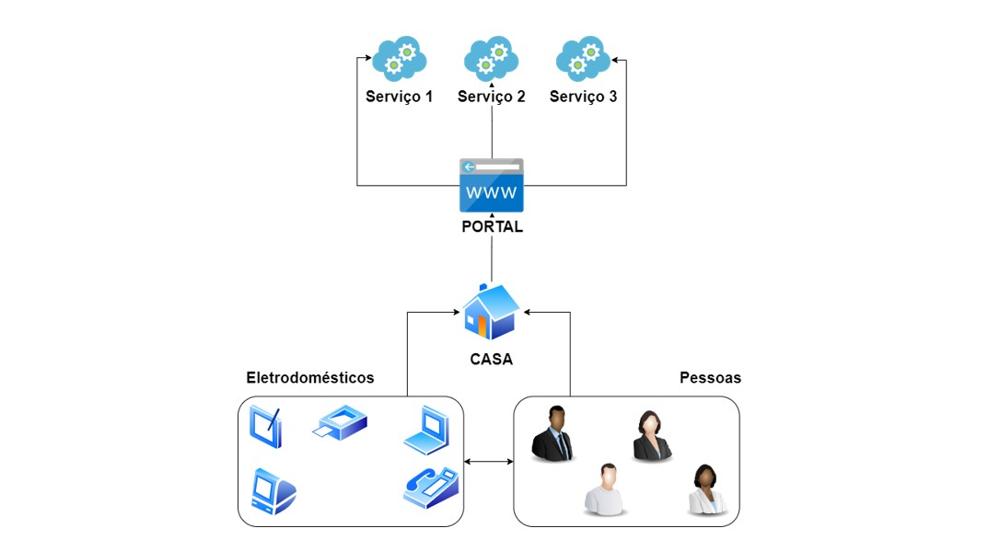

# FIAP-GRUPO-44
Controlador de gastos de eletrodomésticos
## Introdução:

O presente projeto tem como principio atender as diretrizes solicitadas pela pós graduação da FIAP no desenvolvimento do Tech Chellenge. Em suma o projeto visa desenvolver uma solução que provisione o monitoramento de eletrodoméstico identificando aparelhos com maior consumo, gerenciamento do consumo de energia em tempo real gerando economia para usuario final.
Para atender a demanda em sua complitude o desenvolvimento do projeto se dará por etapas




## Descrição da primeira etapa:

Na primeira etapa foi proposto o desenvolvimento de tres APIs que promovam a manipulação de registros cadastrados para Pessoas, eletrodomésticos e Endereços. As APIs proporcionam a listagem, visualização, criação, atualização e deleção dos registros. Cada operação tem sua tratativa de erros correspondente
<h1 align="center">
  Desenvolvimento das APIs
</h1>

## Tecnologias

- [Spring Boot](https://spring.io/projects/spring-boot):Modulo derivado do Spring Framework que facilita desenvolvimento de aplicações java implementando injeção e inversão de dependencias
- [H2](https://github.com/h2database/h2database/releases/download/version-2.2.220/h2.pdf): Gerenciador de banco de dados relacional
- [Postman](https://learning.postman.com/docs/developer/postman-api/intro-api/): Ferramenta destinada a desenvolvedores que possibilita testar chamadas API e gerar documentação de forma iterativa.Foi usado neste projeto para gerar collections e realizar teste de chamadas aos endpoints;
- [Tortoise](https://tortoisegit.org/docs/tortoisegit/): Ferramenta gerencial que facilita manipulação de projetos em GIT. Foi usado neste projeto para resolução de conflitos.
- [Sourcetree](https://confluence.atlassian.com/get-started-with-sourcetree): Assim como o Tortoise é uma ferramenta gerencial para facilitar o desenvolvimento de projetos em Git, no entanto possui uma interface mais receptivel e navegabilidade facilitada.Foi usado neste projeto paa navegação e criação de ramos.
## Práticas adotadas


- Uso de DTOs para a API
- Injeção de Dependências


## Como Executar

### Localmente
- Clonar repositório git
- Construir o projeto:
```
./mvnw clean package
```
- Executar:


A API poderá ser acessada em [localhost:8080](http://localhost:8080)

O Swagger poderá ser visualizado em [localhost:8080/swagger-ui.html](http://localhost:8080/swagger-ui.html)


<h1 align="center">
  API Pessoas
</h1>

<p align="center">
 https://github.com/jessemusic/FIAP-GRUPO-44 
</p>

API para gerenciar pessoas (CRUD) que faz parte do primeiro Módulo (https://github.com/jessemusic/FIAP-GRUPO-44 ).

O projeto foi elaborado PÓS TECH e Apresentação do Tech Challenge ).


## API Endpoints

Para fazer as requisições HTTP abaixo, foi utilizada a ferramenta [http](https://web.postman.co/workspaces):

Lista de pessoas

- GET /pessoas
```
http GET http://localhost:8080/pessoas

HTTP/1.1 200 OK
Content-Length: 129
Content-Type: application/json

{
    "content": [
        {
            "id": 1,
            "nome": "Fernanda",
            "sobrenome": "Alcantara",
            "dataNascimento": "1971-01-21",
            "sexo": "F"
        },
        {
            "id": 2,
            "nome": "Fernanda",
            "sobrenome": "Alcantara",
            "dataNascimento": "1971-01-21",
            "sexo": "F"
        },
        {
            "id": 3,
            "nome": "Fernanda",
            "sobrenome": "Alcantara",
            "dataNascimento": "1971-01-21",
            "sexo": "F"
        },
        {
            "id": 4,
            "nome": "Fernanda",
            "sobrenome": "Alcantara",
            "dataNascimento": "1971-01-21",
            "sexo": "F"
        },
        {
            "id": 5,
            "nome": "Fernanda",
            "sobrenome": "Alcantara",
            "dataNascimento": "1971-01-21",
            "sexo": "F"
        },
        {
            "id": 6,
            "nome": "Fernanda",
            "sobrenome": "Alcantara",
            "dataNascimento": "1971-01-21",
            "sexo": "F"
        }
    ],
    "pageable": {
        "sort": {
            "empty": true,
            "sorted": false,
            "unsorted": true
        },
        "offset": 0,
        "pageSize": 10,
        "pageNumber": 0,
        "paged": true,
        "unpaged": false
    },
    "last": true,
    "totalElements": 6,
    "totalPages": 1,
    "size": 10,
    "number": 0,
    "sort": {
        "empty": true,
        "sorted": false,
        "unsorted": true
    },
    "first": true,
    "numberOfElements": 6,
    "empty": false
}

```
CADASTRO DE PESSOAS
- POST /pessoas
```
http POST http://localhost:8080/pessoas

HTTP/1.1 200 OK
Content-Length: 129
Content-Type: application/json

{
     "nome": "Fernanda",
     "sobrenome": "Alcantara",
     "dataNascimento": "1971-01-21",
     "sexo": "F"
}
```

- GET /pessoas/{id}
```
http://localhost:8080/pessoas/2
HTTP/1.1 200 OK
Content-Length: 129
Content-Type: application/json

{
    "id": 2,
    "nome": "Fernanda",
    "sobrenome": "Rancho fundo Mauá",
    "dataNascimento": "1971-01-21",
    "sexo": "F"
}
```

- PUT /pessoas/1
```
tp://localhost:8080/pessoas/1
HTTP/1.1 200 OK
Content-Type: application/json
transfer-encoding: chunked

{
    "nome": "James",
    "sobrenome": null,
    "dataNascimento": "1971-01-21",
    "sexo": "M"
}
```
Alteração de campo único por exemplo:
- PATCH /pessoas/{id}
```
PATCH http://localhost:8080/pessoas/1
HTTP/1.1 200 OK
Content-Length: 142
Content-Type: application/json

{

   "sobrenome": "Rancho fundo Mauá"
           
}
 Retorna a alteração 
{
    "id": 1,
    "nome": "Fernanda",
    "sobrenome": "Rancho fundo Mauá",
    "dataNascimento": "1971-01-21",
    "sexo": "F"
}
```

Deletando uma pessoa:
- DELETE /pessoas/{id}
```
DELETE http://localhost:8080/pessoas/1
HTTP/1.1 204 No Content
Content-Length: 142
Content-Type: application/json

```

<h1 align="center">
  API Eletrodomésticos
</h1>

<p align="center">
 https://github.com/jessemusic/FIAP-GRUPO-44 
</p>

API para gerenciamento de eletrodomésticos. Ao consumir esta api o desenvolvedor conseguirá realizar a criação, leitura,atualização,leitura e deleção(CRUD) dos registros de eletrodomésticos.

## API Endpoints


Lista de eletrodomésticos

- GET /eletrodomesticos

```
http GET http://localhost:8080/eletrodomesticos
{
    "content": [
        {
            "id": 1,
            "nome": "ABRIDOR/AFIADOR",
            "modelo": "MultiSharp",
            "marca": "Philips",
            "tensao": "110v",
            "potencia": 135.0,
            "usoDiasEstimados": 10,
            "usoDiarioEstimado": 5,
            "consumoDiario": 0.011249999955,
            "consumoMensal": 0.11249999955,
            "custoDiario": 0.0101249999595,
            "custoMensal": 0.101249999595,
            "idPatchCategoria": 6
        },
        {
            "id": 2,
            "nome": "AFIADOR DE FACAS",
            "modelo": "BladeSharp",
            "marca": "Philips",
            "tensao": "110v",
            "potencia": 20.0,
            "usoDiasEstimados": 5,
            "usoDiarioEstimado": 30,
            "consumoDiario": 0.01,
            "consumoMensal": 0.05,
            "custoDiario": 0.009000000000000001,
            "custoMensal": 0.045000000000000005,
            "idPatchCategoria": 6
        },
        {
            "id": 3,
            "nome": "APARELHO DE SOM3 EM 1",
            "modelo": "SoundFusion 3-in-1",
            "marca": "JBL",
            "tensao": "110v",
            "potencia": 80.0,
            "usoDiasEstimados": 20,
            "usoDiarioEstimado": 180,
            "consumoDiario": 0.24,
            "consumoMensal": 4.8,
            "custoDiario": 0.216,
            "custoMensal": 4.32,
            "idPatchCategoria": 9
        },
        {
            "id": 4,
            "nome": "APARELHO DE SOM PEQUENO",
            "modelo": "MiniTunes E-100",
            "marca": "JBL",
            "tensao": "110v",
            "potencia": 20.0,
            "usoDiasEstimados": 30,
            "usoDiarioEstimado": 240,
            "consumoDiario": 0.08,
            "consumoMensal": 2.4,
            "custoDiario": 0.07200000000000001,
            "custoMensal": 2.16,
            "idPatchCategoria": 9
        },
        {
            "id": 5,
            "nome": "AQUECEDOR DE AMBIENTE",
            "modelo": "HeatWave ProHeat",
            "marca": "Daikin",
            "tensao": "220V",
            "potencia": 1550.0,
            "usoDiasEstimados": 15,
            "usoDiarioEstimado": 480,
            "consumoDiario": 12.4,
            "consumoMensal": 186.0,
            "custoDiario": 11.16,
            "custoMensal": 167.4,
            "idPatchCategoria": 3
        }
    ],
    "pageable": {
        "sort": {
            "empty": true,
            "sorted": false,
            "unsorted": true
        },
        "offset": 0,
        "pageNumber": 0,
        "pageSize": 5,
        "unpaged": false,
        "paged": true
    },
    "last": false,
    "totalElements": 89,
    "totalPages": 18,
    "size": 5,
    "number": 0,
    "sort": {
        "empty": true,
        "sorted": false,
        "unsorted": true
    },
    "first": true,
    "numberOfElements": 5,
    "empty": false
}
```

Possiveis filtros;
- - **pagina**:Parametro não obrigatório que define o numero da pagina que o usuário deseja acessar
- - **tamanho**: Parametro não obrigatório que define a quantidade de itens que serão retornados pela listagem
- - **nome**: Parametro não obrigatório que filtra a lista de eletrodomésticos por nome;
- - **marca**:Parametro não obrigatório que filtra a lista de eletrodoméstico por marca;
- - **modelo**:Parametro não obrigatório que filtra a lista de eletrodoméstico por modelo;
- - **tensao**:Parametro não obrigatório que filtra a lista de eletrodoméstico por tensão (Ex:110v,220v ou Bivolt);
- - **Categoria**:Parametro não obrigatório que filtra a lista de eletrodoméstico por categoria (IDentificador da categoria).Exemplo 1,2,6,8;

* GET /eletrodomesticos/{id}
```
http://localhost:8080/eletrodomesticos/10

 {
    "id": 10,
    "nome": "AR-CONDICIONADO 15.000 BTU",
    "modelo": "15.000 BTU",
    "marca": "Daikin",
    "tensao": "BIVOLT",
    "potencia": 2000.0,
    "usoDiasEstimados": 30,
    "usoDiarioEstimado": 480,
    "consumoDiario": 16.0,
    "consumoMensal": 480.0,
    "custoDiario": 14.4,
    "custoMensal": 432.0,
    "idPatchCategoria": 3
}
```

* GET /eletrodomesticos/aleatorios
```
http://localhost:8080/eletrodomesticos/aleatorios

[
	{
		"id": 31,
		"nome": "CORTADOR DE GRAMA PEQUENO",
		"modelo": "GR1000",
		"marca": "Black+Decker",
		"tensao": "110v",
		"potencia": 500.0,
		"usoDiasEstimados": 2,
		"usoDiarioEstimado": 120,
		"consumoDiario": 1.0,
		"consumoMensal": 2.0,
		"custoDiario": 0.9,
		"custoMensal": 1.8,
		"idPatchCategoria": 1
	},
	{
		"id": 17,
		"nome": "BOILER 200 a 500 L",
		"modelo": "200 a 500 L",
		"marca": "KSB",
		"tensao": "110v",
		"potencia": 3000.0,
		"usoDiasEstimados": 30,
		"usoDiarioEstimado": 360,
		"consumoDiario": 18.0,
		"consumoMensal": 540.0,
		"custoDiario": 16.2,
		"custoMensal": 486.0,
		"idPatchCategoria": 2
	}
]
```
- - Retorna uma lista coom um numero aleatório entre um a doze eletrodomésticos de categoriaas diferentes


CADASTRO DE ELETRODOMESTICOS
* POST /eletrodomesticos

```
http POST http://localhost:8080/eletrodomesticos
HTTP/1.1 201 CREATED
Content-Length: 129
Content-Type: application/json

{
    "nome": "Notebook",
    "modelo": "inspiron 14",
    "marca":"Dell",
    "tensao": "Bivolt",
    "potencia": 500.0
}
```
ATUALIZAÇÃO DE ELETRODOMÉSTICOS:

- PUT /eletrodomesticos/9
```
http://localhost:8080/eletrodomesticos/9
HTTP/1.1 200 OK
Content-Length: 129
Content-Type: application/json

{
    "nome": "AR-CONDICIONADO 12.000 BTU",
    "modelo": " 12.000 BTU",
    "marca": "Daikin",
    "tensao": "BIVOLT",
    "potencia": 1450.0,
    "usoDiasEstimados": 30,
    "usoDiarioEstimado": 480,
    "idPatchCategoria": 3
}
```
- PATCH: /eletrodomesticos/9
```
http://localhost:8080/eletrodomesticos/9
HTTP/1.1 200 OK
Content-Length: 129
Content-Type: application/json

{
    "nome": "AR-CONDICIONADO 12.000 BTU"
}
```
DELEÇÃO DE ELETRODOMÉSTICO
- DELETE /eletrodomesticos/{id}
```
DELETE http://localhost:8080/eletrodomesticos/9
HTTP/1.1 204 No Content
Content-Length: 142
Content-Type: application/json

```
## Parametos de requisição:
| Parametro        |  Tipo  |       Atribuição                    |   Exemplo   |
|:-----------------|:------:|:-----------------------------------|:------------|
| nome             | String |  nome do eletrodoméstico            | Computador  |
| marca            | String |  Marca do eletrodoméstico           | Sansung     |
| modelo           | String |  Modelo do eletrodoméstico          | Galaxy Book |
| tensão           | String |  Tensão do dispostivo               | 200         |
| usoDiasEstimados |  Long  |  Numero de dias de uso              | 15          |
|usoDiarioEstimado |  Long  |  Tempo de uso por dia em minutos    | 180         |
| idPatchCategoria |  Long  |  Categoria do eletrodoméstico       | 1 (Limpeza) |
| consumoDiario    | Double |  Consumo diário do dispositivo em Kw/h | -           |
| consumoMensal    | Double |  Consumo mensal do dispositivo em Kw/h | -           |
| custoDiario      | Double |  Custo de consumo diário em R$      | -           |
| custoMensal      | Double |  Custo de consumo mensal em R$      | -           |

**CATEGORIAS**
1. Acessório de aquário
2. Conforto térmico
3. Construção
4. Cucção
5. Culinária
6. Entretenimento
7. Hidráulica
8. Higiene pessoal
9. Iluminação
10. Lavanderia
11. Limpeza
12. Processador de alimentos
13. Refrigerador
14. Tecnologia
15. Costura


- **Cálculos de consumo/custo diário/mensal**:Os calculos de consumo diários e mansais assim como o calculo de custos são efetuados a partir dos dados enviados pelos parametros usoDiasEstimados que são o numero de dias em que o dispositivo foi usado e usoDiarioEstimado que é o tempo em minutos que o dispositivo se manteve ativo no dia
<p align="center">
  consumoDiário (KW/H) = potencia * (usoDiario / 60) / 1000;
</p>
<p align="center">
  consumoMensal (KW/H) = consumoDiario *  usoDiasEstimados;
</p>
<p align="center">
  custoDiario R$: consumoDiario * 0.9 (Tarifa usado como base de cálculo)
</p>
<p align="center">
  custoMensal R$: consumoDiario * usoDiasEstimados
</p>

<h1 align="center">
  API ENDEREÇOS
</h1>

API para gerenciamento de Endereços. Ao consumir esta api o desenvolvedor conseguirá realizar a criação, leitura,atualização e deleção(CRUD) dos registros de enderelos.


## API Endpoints

#LISTA DE ENDEREÇOS

```
GET http://localhost:8080/buscar-todos?pagina=0&tamanho=10

RESPONSE
{
    "data": [
        {
            "id": 1,
            "rua": "Estrada de Itapecerica",
            "numero": 3550308,
            "bairro": "Capão Redondo",
            "cidade": "São Paulo",
            "estado": "SP",
            "cep": "05858001",
            "pessoasDTO": [
                {
                    "id": 1,
                    "nome": "João",
                    "sobrenome": null,
                    "dataNascimento": "2022-12-23",
                    "sexo": "M",
                    "idade": null,
                    "email": null,
                    "phone": null,
                    "cell": null,
                    "fotosUrls": null,
                    "nat": null,
                    "somatorioCustoMensal": null,
                    "eletrodomesticos": [],
                    "enderecos": []
                },
                {
                    "id": 2,
                    "nome": "Antonio",
                    "sobrenome": null,
                    "dataNascimento": "2022-12-23",
                    "sexo": "M",
                    "idade": null,
                    "email": null,
                    "phone": null,
                    "cell": null,
                    "fotosUrls": null,
                    "nat": null,
                    "somatorioCustoMensal": null,
                    "eletrodomesticos": [],
                    "enderecos": []
                }
            ]
        },
        {
            "id": 2,
            "rua": "Avenida Lins de Vasconcelos",
            "numero": 3550308,
            "bairro": "Cambuci",
            "cidade": "São Paulo",
            "estado": "SP",
            "cep": "01538001",
            "pessoasDTO": [
                {
                    "id": 4,
                    "nome": "Nueza",
                    "sobrenome": null,
                    "dataNascimento": "2022-12-23",
                    "sexo": "F",
                    "idade": null,
                    "email": null,
                    "phone": null,
                    "cell": null,
                    "fotosUrls": null,
                    "nat": null,
                    "somatorioCustoMensal": null,
                    "eletrodomesticos": [],
                    "enderecos": []
                }
            ]
        }
    ],
    "paginator": {
        "pageNumber": 0,
        "totalElements": 2,
        "totalPages": 1
    }
}

```
LISTAR POR ID


```
GET http://localhost:8080/buscar-getID?id=1

RESPONSE:
{
    "id": 1,
    "rua": "RUA 5",
    "numero": 1000,
    "bairro": "CAPÃO REDONDA",
    "cidade": "SÃO PAULO",
    "estado": "SP",
    "cep": "01538001"
}


```
#CADASTRAR ENDEREÇOS

```
POST http://localhost:8080/salvar

HTTP/1.1 201 CREATED
Content-Length: 129
Content-Type: application/json

REQUEST BODY

{
    "cep": "01538001",
    "pessoa": {
        "id": 1,
        "nome": "Ernesto Sambongo"
    }
}


RESPONSE

{
    "id": 1,
    "rua": "Avenida Lins de Vasconcelos",
    "numero": 3550308,
    "bairro": "Cambuci",
    "cidade": "São Paulo",
    "estado": "SP",
    "cep": "01538001"
}


```
#ATUALIZAR ENDEREÇO

```
PUT http://localhost:8080/atualizar/3

REQUEST BODY
{
   "rua":"RUA 5",
   "numero":"1000",
   "bairro":"CAPÃO REDONDA",
   "cidade":"SÃO PAULO",
   "estado":"SP"
}

RESPOSE

{
    "id": 1,
    "rua": "RUA 5",
    "numero": 1000,
    "bairro": "CAPÃO REDONDA",
    "cidade": "SÃO PAULO",
    "estado": "SP",
    "cep": "01538001"
}

```
DELETANDO ENDEREÇO
```

http://localhost:8080/apagar/10

Removido o endereço de ID: 10

```
<h1 align="center">
API Pessoas
</h1>
<h1 align="center">
API GERADORA DE PESSOAS AUTOMÁTICAS COM ELETRÔNICOS E ENDEREÇO
</h1>
<p align="center">
 https://github.com/jessemusic/FIAP-GRUPO-44 
</p>
O objetivo dessa API é gerar pessoas aleatórias que tenha um cep, ou seja, uma pessoa sabe onde mora e também sabe 
o número de sua casa. Tendo em vista essas ações , então a API automática criará uma pessoas como se fosse na vida real, já com número de casa e 
um conjunto de eletrodomésticos que são usado para o cálculo de sua despesa mensal com energia elétrica.
Essa API, é um desenvolvimento personalidado do grupo 44, com a intenção de mostrar a automação de processos.
Ao criar a pessoa automática, esta já vem com seus eletrodomésticos e seus gastos mensais com energia elétrica , que está no atributo"somatorioCustoMensal" no json de resposta. 
Também essa pessoa já possui uma foto que já vem diretamete no json com o atributo "fotosUrls"
                            
A API faz integração com duas APIs externas e foi criado um adpter com in para o controller e out para chamadas de API externas. Usando um pedaço de modelo de arquitetura hexagonal.
Dentro desse adpter são feitas as lógicas de comunicação interna e externa. A API também consome um banco de dados com mais de um milhão de ids cada contendo CEPs válidos para serem 
consumido na chamada da API de endereços que busca já o cep gerado randomicamente seu ID via código no serviço da classe Pessoa, para então fazer o pedido para a API de endereços a partir desse cep escolhido.

Para criar a pessoa e dar vida e dívidas a ela, basta consumir o endpoint /pessoas/cria<br>
http://localhost:8080/pessoas/cria

```
{
    "id": 22,
    "nome": "Ms Nanna",
    "sobrenome": "Larsen",
    "dataNascimento": "1990-04-13T18:02:23.755Z",
    "sexo": "female",
    "idade": 33,
    "email": "nanna.larsen@example.com",
    "phone": "07749917",
    "cell": "53652133",
    "fotosUrls": "https://randomuser.me/api/portraits/women/51.jpg",
    "nat": "DK",
    "somatorioCustoMensal": 846.9,
    "eletrodomesticos": [
        {
            "id": 9,
            "nome": "AR-CONDICIONADO 15.000 BTU",
            "modelo": "15.000 BTU",
            "marca": "Daikin",
            "tensao": "BIVOLT",
            "potencia": 2000.0,
            "usoDiasEstimados": 30,
            "usoDiarioEstimado": 480,
            "consumoDiario": 16.0,
            "consumoMensal": 480.0,
            "custoDiario": 14.4,
            "custoMensal": 432.0,
            "idPatchCategoria": 3
        },
        {
            "id": 30,
            "nome": "CORTADOR DE GRAMA PEQUENO",
            "modelo": "GR1000",
            "marca": "Black+Decker",
            "tensao": "110v",
            "potencia": 500.0,
            "usoDiasEstimados": 2,
            "usoDiarioEstimado": 120,
            "consumoDiario": 1.0,
            "consumoMensal": 2.0,
            "custoDiario": 0.9,
            "custoMensal": 1.8,
            "idPatchCategoria": 1
        },
        {
            "id": 47,
            "nome": "GELADEIRA 2 PORTAS",
            "modelo": "Pro 1000",
            "marca": "Consul",
            "tensao": "110v",
            "potencia": 130.0,
            "usoDiasEstimados": 30,
            "usoDiarioEstimado": 1440,
            "consumoDiario": 3.12,
            "consumoMensal": 93.60000000000001,
            "custoDiario": 2.8080000000000003,
            "custoMensal": 84.24000000000001,
            "idPatchCategoria": 4
        },
        {
            "id": 15,
            "nome": "BOILER 100 L",
            "modelo": "100 L",
            "marca": "KSB",
            "tensao": "110v",
            "potencia": 2030.0,
            "usoDiasEstimados": 30,
            "usoDiarioEstimado": 360,
            "consumoDiario": 12.18,
            "consumoMensal": 365.4,
            "custoDiario": 10.962,
            "custoMensal": 328.86,
            "idPatchCategoria": 2
        }
    ],
    "enderecos": [
        {
            "id": 23,
            "rua": "Rua Armando Marino",
            "numero": 746,
            "bairro": "Fioravante Marino",
            "cidade": "Colatina",
            "estado": "ES",
            "cep": "29705800"
        }
    ]
}

Gerando outra pessoa
{
    "id": 23,
    "nome": "Mrs Elisa",
    "sobrenome": "Hidalgo",
    "dataNascimento": "1959-01-19T17:57:24.142Z",
    "sexo": "female",
    "idade": 64,
    "email": "elisa.hidalgo@example.com",
    "phone": "973-467-760",
    "cell": "699-508-135",
    "fotosUrls": "https://randomuser.me/api/portraits/women/0.jpg",
    "nat": "ES",
    "somatorioCustoMensal": 4.104,
    "eletrodomesticos": [
        {
            "id": 29,
            "nome": "CORTADOR DE GRAMA GRANDE",
            "modelo": "LC221RH",
            "marca": "Husqvarna",
            "tensao": "110v",
            "potencia": 1140.0,
            "usoDiasEstimados": 2,
            "usoDiarioEstimado": 120,
            "consumoDiario": 2.28,
            "consumoMensal": 4.56,
            "custoDiario": 2.052,
            "custoMensal": 4.104,
            "idPatchCategoria": 1
        }
    ],
    "enderecos": [
        {
            "id": 24,
            "rua": "Rua Amós",
            "numero": 268,
            "bairro": "Canaã",
            "cidade": "Ipatinga",
            "estado": "MG",
            "cep": "35164135"
        }
    ]
}

Gerando outra pessoa

{
    "id": 24,
    "nome": "Mrs Filippa",
    "sobrenome": "Kildahl",
    "dataNascimento": "1971-07-11T06:43:34.761Z",
    "sexo": "female",
    "idade": 52,
    "email": "filippa.kildahl@example.com",
    "phone": "36922805",
    "cell": "48523383",
    "fotosUrls": "https://randomuser.me/api/portraits/women/67.jpg",
    "nat": "NO",
    "somatorioCustoMensal": 407.49899989932,
    "eletrodomesticos": [
        {
            "id": 25,
            "nome": "CHUVEIRO ELÉTRICO",
            "modelo": "HeatWave ShowerX-100",
            "marca": "AquaFlow",
            "tensao": "110v",
            "potencia": 3500.0,
            "usoDiasEstimados": 30,
            "usoDiarioEstimado": 40,
            "consumoDiario": 2.3333333310000004,
            "consumoMensal": 69.99999993000002,
            "custoDiario": 2.0999999979000004,
            "custoMensal": 62.99999993700001,
            "idPatchCategoria": 2
        },
        {
            "id": 11,
            "nome": "ASPIRADOR DE PÓ",
            "modelo": "PowerClean 2000",
            "marca": "Mindial",
            "tensao": "110v",
            "potencia": 100.0,
            "usoDiasEstimados": 30,
            "usoDiarioEstimado": 20,
            "consumoDiario": 0.0333333333,
            "consumoMensal": 0.9999999989999999,
            "custoDiario": 0.029999999969999996,
            "custoMensal": 0.8999999990999998,
            "idPatchCategoria": 1
        },
        {
            "id": 53,
            "nome": "LÂMPADA INCANDESCENTE – 40 W",
            "modelo": "BOA84AE",
            "marca": "Energizer",
            "tensao": "110v",
            "potencia": 40.0,
            "usoDiasEstimados": 30,
            "usoDiarioEstimado": 330,
            "consumoDiario": 0.22,
            "consumoMensal": 6.6,
            "custoDiario": 0.198,
            "custoMensal": 5.94,
            "idPatchCategoria": 11
        },
        {
            "id": 61,
            "nome": "MICROCOMPUTADOR",
            "modelo": "BRM34BB",
            "marca": "Consul",
            "tensao": "110v",
            "potencia": 120.0,
            "usoDiasEstimados": 30,
            "usoDiarioEstimado": 180,
            "consumoDiario": 0.36,
            "consumoMensal": 10.799999999999999,
            "custoDiario": 0.324,
            "custoMensal": 9.72,
            "idPatchCategoria": 12
        },
        {
            "id": 37,
            "nome": "FERRO ELÉTRICO AUTOMÁTICO",
            "modelo": "F200",
            "marca": "Black+Decker",
            "tensao": "220V",
            "potencia": 1000.0,
            "usoDiasEstimados": 12,
            "usoDiarioEstimado": 60,
            "consumoDiario": 1.0,
            "consumoMensal": 12.0,
            "custoDiario": 0.9,
            "custoMensal": 10.8,
            "idPatchCategoria": 10
        },
        {
            "id": 49,
            "nome": "IOGURTEIRA",
            "modelo": "BVE10",
            "marca": "",
            "tensao": "110v",
            "potencia": 26.0,
            "usoDiasEstimados": 10,
            "usoDiarioEstimado": 30,
            "consumoDiario": 0.013,
            "consumoMensal": 0.13,
            "custoDiario": 0.0117,
            "custoMensal": 0.117,
            "idPatchCategoria": 6
        },
        {
            "id": 43,
            "nome": "FREEZER VERTICAL/HORIZONTAL",
            "modelo": "H300",
            "marca": "George Foreman",
            "tensao": "110v",
            "potencia": 130.0,
            "usoDiasEstimados": 24,
            "usoDiarioEstimado": 1440,
            "consumoDiario": 3.12,
            "consumoMensal": 74.88,
            "custoDiario": 2.8080000000000003,
            "custoMensal": 67.39200000000001,
            "idPatchCategoria": 4
        },
        {
            "id": 33,
            "nome": "ESPREMEDOR DE FRUTAS",
            "modelo": "RI2730",
            "marca": "Philips Walita",
            "tensao": "110v",
            "potencia": 65.0,
            "usoDiasEstimados": 20,
            "usoDiarioEstimado": 10,
            "consumoDiario": 0.010833333289999999,
            "consumoMensal": 0.21666666579999996,
            "custoDiario": 0.009749999960999999,
            "custoMensal": 0.19499999921999997,
            "idPatchCategoria": 8
        },
        {
            "id": 42,
            "nome": "FORNO MICROONDAS",
            "modelo": "NN-ST67HSRUN",
            "marca": "Philips Walita",
            "tensao": "220V",
            "potencia": 1200.0,
            "usoDiasEstimados": 30,
            "usoDiarioEstimado": 20,
            "consumoDiario": 0.39999999960000004,
            "consumoMensal": 11.999999988,
            "custoDiario": 0.35999999964000007,
            "custoMensal": 10.799999989200002,
            "idPatchCategoria": 7
        },
        {
            "id": 6,
            "nome": "AR-CONDICIONADO 7.500 BTU",
            "modelo": "7.500 BTU",
            "marca": "Daikin",
            "tensao": "BIVOLT",
            "potencia": 1000.0,
            "usoDiasEstimados": 30,
            "usoDiarioEstimado": 480,
            "consumoDiario": 8.0,
            "consumoMensal": 240.0,
            "custoDiario": 7.2,
            "custoMensal": 216.0,
            "idPatchCategoria": 3
        },
        {
            "id": 72,
            "nome": "SECADOR DE CABELO GRANDE",
            "modelo": "DF42",
            "marca": "Samsung",
            "tensao": "110v",
            "potencia": 1400.0,
            "usoDiasEstimados": 30,
            "usoDiarioEstimado": 10,
            "consumoDiario": 0.23333333239999998,
            "consumoMensal": 6.9999999719999995,
            "custoDiario": 0.20999999915999998,
            "custoMensal": 6.2999999747999995,
            "idPatchCategoria": 5
        },
        {
            "id": 83,
            "nome": "TV EM CORES – 29″",
            "modelo": "BVE10",
            "marca": "SONY",
            "tensao": "110v",
            "potencia": 110.0,
            "usoDiasEstimados": 30,
            "usoDiarioEstimado": 330,
            "consumoDiario": 0.605,
            "consumoMensal": 18.15,
            "custoDiario": 0.5445,
            "custoMensal": 16.335,
            "idPatchCategoria": 9
        }
    ],
    "enderecos": [
        {
            "id": 25,
            "rua": "Área Rural",
            "numero": 928,
            "bairro": "Área Rural de Florianópolis",
            "cidade": "Florianópolis",
            "estado": "SC",
            "cep": "88099899"
        }
    ]
}

Mais outra pessoa


    "id": 25,
    "nome": "Mrs Sanni",
    "sobrenome": "Salminen",
    "dataNascimento": "1985-10-28T07:58:29.424Z",
    "sexo": "female",
    "idade": 37,
    "email": "sanni.salminen@example.com",
    "phone": "07-364-694",
    "cell": "046-186-38-83",
    "fotosUrls": "https://randomuser.me/api/portraits/women/91.jpg",
    "nat": "FI",
    "somatorioCustoMensal": 393.16499999999996,
    "eletrodomesticos": [
        {
            "id": 73,
            "nome": "SECADOR DE CABELOS PEQUENO",
            "modelo": "GR20B",
            "marca": "Philips",
            "tensao": "110v",
            "potencia": 600.0,
            "usoDiasEstimados": 30,
            "usoDiarioEstimado": 900,
            "consumoDiario": 9.0,
            "consumoMensal": 270.0,
            "custoDiario": 8.1,
            "custoMensal": 243.0,
            "idPatchCategoria": 5
        },
        {
            "id": 23,
            "nome": "CAFETEIRA ELÉTRICA",
            "modelo": "BrewMaster ",
            "marca": "JavaEase",
            "tensao": "110v",
            "potencia": 600.0,
            "usoDiasEstimados": 30,
            "usoDiarioEstimado": 60,
            "consumoDiario": 0.6,
            "consumoMensal": 18.0,
            "custoDiario": 0.54,
            "custoMensal": 16.200000000000003,
            "idPatchCategoria": 6
        },
        {
            "id": 46,
            "nome": "GELADEIRA 1 PORTA",
            "modelo": "ERC50",
            "marca": "Consul",
            "tensao": "110v",
            "potencia": 90.0,
            "usoDiasEstimados": 30,
            "usoDiarioEstimado": 1440,
            "consumoDiario": 2.16,
            "consumoMensal": 64.80000000000001,
            "custoDiario": 1.9440000000000002,
            "custoMensal": 58.32000000000001,
            "idPatchCategoria": 4
        },
        {
            "id": 40,
            "nome": "FORNO · RESISTÊNCIA GRANDE",
            "modelo": "CFO4NAB",
            "marca": "Brastemp",
            "tensao": "110v",
            "potencia": 1500.0,
            "usoDiasEstimados": 30,
            "usoDiarioEstimado": 60,
            "consumoDiario": 1.5,
            "consumoMensal": 45.0,
            "custoDiario": 1.35,
            "custoMensal": 40.5,
            "idPatchCategoria": 7
        },
        {
            "id": 31,
            "nome": "ENCERADEIRA",
            "modelo": "ERC50",
            "marca": "Electrolux",
            "tensao": "110v",
            "potencia": 500.0,
            "usoDiasEstimados": 2,
            "usoDiarioEstimado": 120,
            "consumoDiario": 1.0,
            "consumoMensal": 2.0,
            "custoDiario": 0.9,
            "custoMensal": 1.8,
            "idPatchCategoria": 1
        },
        {
            "id": 17,
            "nome": "BOMBA D’ÁGUA 1/4 CV",
            "modelo": " 1/4 CV",
            "marca": "KSB",
            "tensao": "110v",
            "potencia": 335.0,
            "usoDiasEstimados": 30,
            "usoDiarioEstimado": 30,
            "consumoDiario": 0.1675,
            "consumoMensal": 5.025,
            "custoDiario": 0.15075000000000002,
            "custoMensal": 4.522500000000001,
            "idPatchCategoria": 2
        },
        {
            "id": 89,
            "nome": "VIDEOGAME",
            "modelo": "ONE",
            "marca": "XBOX",
            "tensao": "110v",
            "potencia": 15.0,
            "usoDiasEstimados": 15,
            "usoDiarioEstimado": 240,
            "consumoDiario": 0.06,
            "consumoMensal": 0.8999999999999999,
            "custoDiario": 0.054,
            "custoMensal": 0.8099999999999999,
            "idPatchCategoria": 9
        },
        {
            "id": 58,
            "nome": "LIQUIDIFICADOR",
            "modelo": "H300",
            "marca": "Consul",
            "tensao": "110v",
            "potencia": 300.0,
            "usoDiasEstimados": 15,
            "usoDiarioEstimado": 15,
            "consumoDiario": 0.075,
            "consumoMensal": 1.125,
            "custoDiario": 0.0675,
            "custoMensal": 1.0125000000000002,
            "idPatchCategoria": 8
        },
        {
            "id": 65,
            "nome": "OZONIZADOR",
            "modelo": "CFO4NAB",
            "marca": "Ozotech",
            "tensao": "110v",
            "potencia": 100.0,
            "usoDiasEstimados": 30,
            "usoDiarioEstimado": 600,
            "consumoDiario": 1.0,
            "consumoMensal": 30.0,
            "custoDiario": 0.9,
            "custoMensal": 27.0,
            "idPatchCategoria": 3
        }
    ],
    "enderecos": [
        {
            "id": 26,
            "rua": "Estrada Municipal Francisco Eugênio Bicudo",
            "numero": 280,
            "bairro": "Jardim Colinas",
            "cidade": "Jacareí",
            "estado": "SP",
            "cep": "12319010"
        }
    ]
}